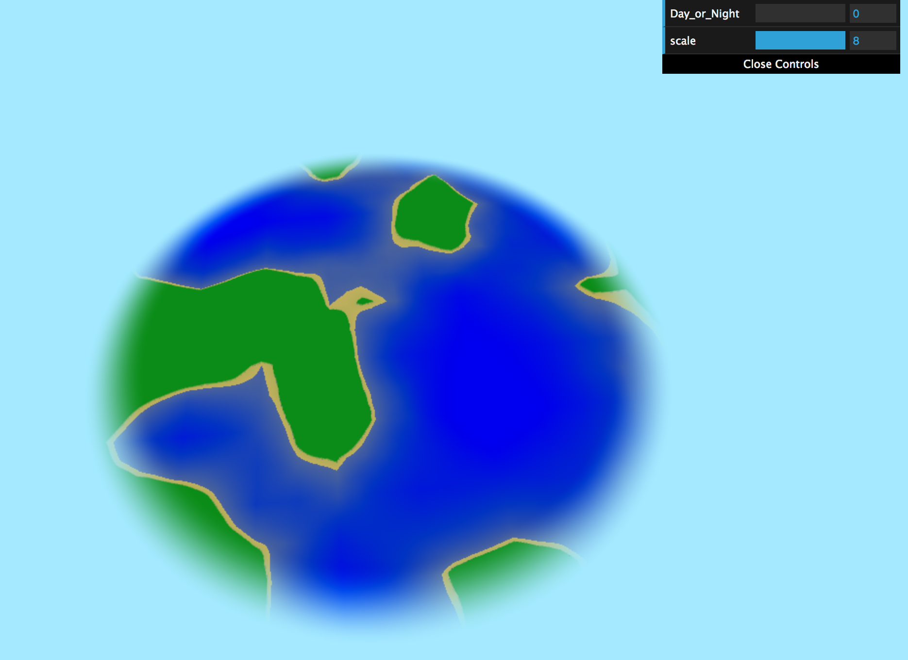
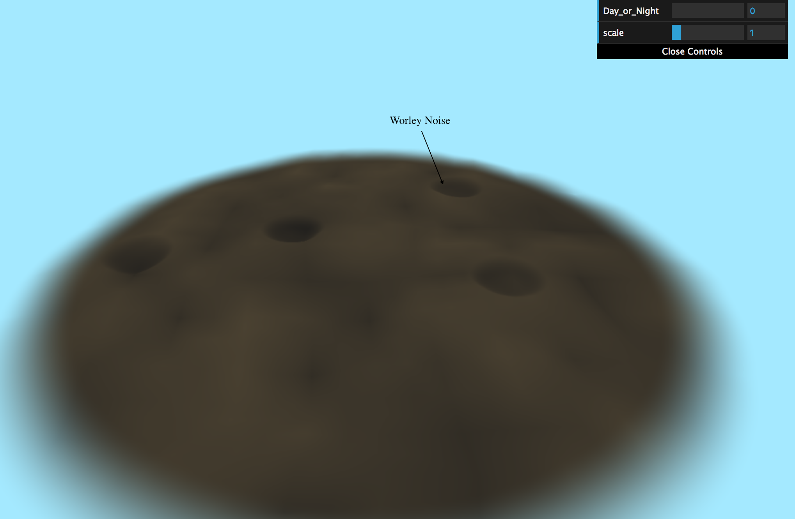
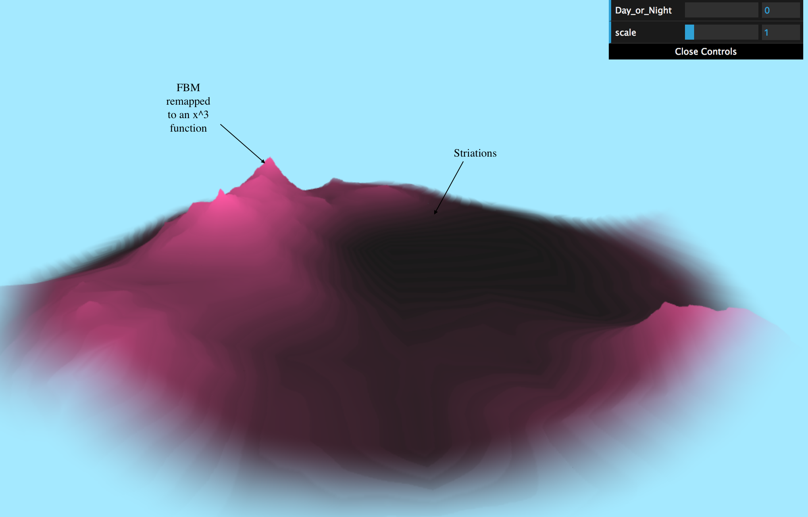
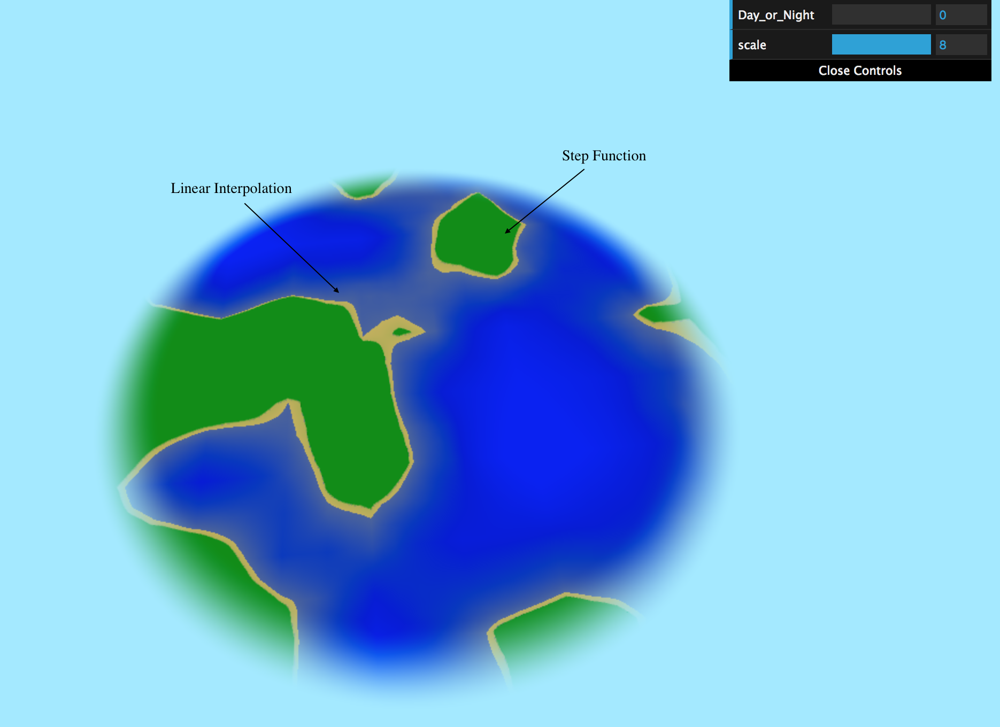
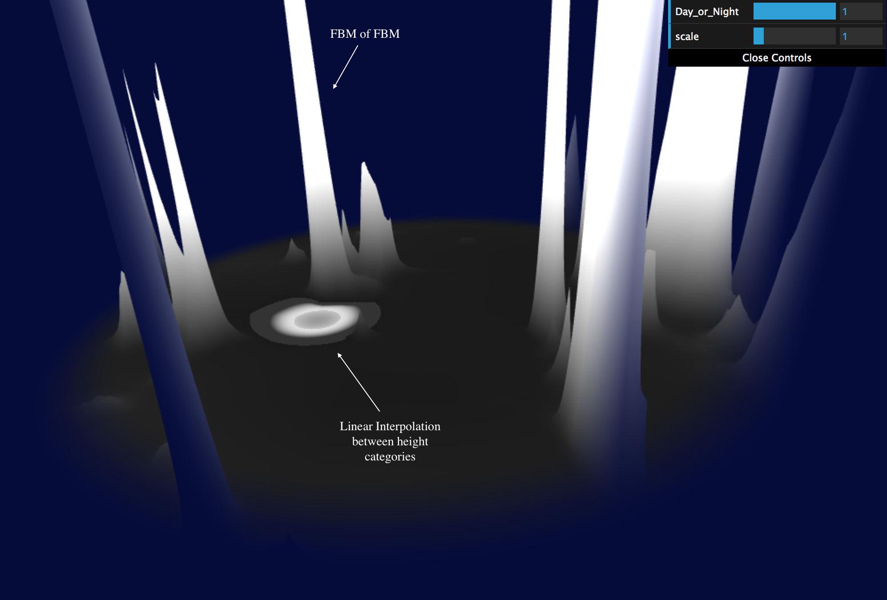
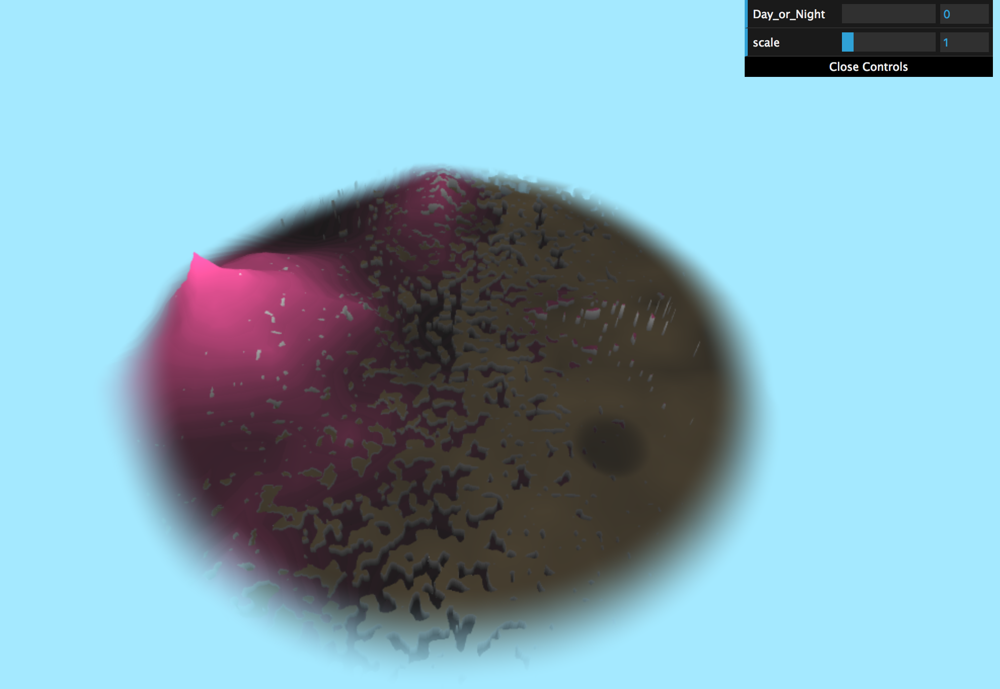
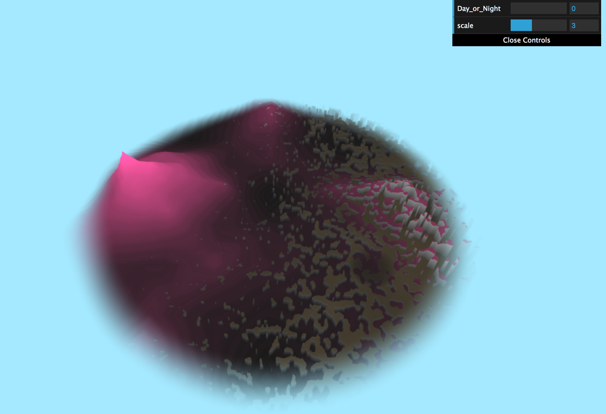

# CIS 566 Noisy Terrain Project
Evelyn Bailey
https://evelyn.pb.studio

The Landscapes

For this project, I used different permutations of Fractal Brownian Motion and Worley Noise to create four different landscapes.

The first landscape I created was a moon-like surface. I achieved this effect by using Worley Noise as a basis for the plane deformation. I then added in some noise using Worley Noise as the input to a Fractal Brownian Motion (FBM) function to perturb the surface as well as add some texture to the landscape.

For this landscape, I used FBM and remapped the distribution of values to a cubic function to achieve the spikey peaks. I added in a square function to perturb the values to achieve the striation you see along the mountain side.

To achieve this effect, I used FBM and created my own step function to remap the values and linear interpolate between the boundaries. The lower three layers are colored to be water, the next layer to be sand, and the top layer to be grass. The linear interpolation between the sand layer and ocean layer gives the effect of the coast submerged under water.

The last landscape is a haunted forest in a black and white color scheme. I used FBM of FBM to achieve the very high peaks for the dead trees and added in Worley Noise to create the small pools of murky ghost water. The color is computed by assigning a color to different height levels and linearly interpolating between the boundaries to create a smooth transition.

Other Features

In addition to the landscapes, I implemented a day/night feature that allows the user to choose to view the scenes in daytime or nighttime. As pictured above, during the day, the sky and color of the distance fog is blue, while the color at night is a dark blue.

Users can also control the 'scale' of the world, or how big each landscape is. I used a Worley Noise function to randomly assign each cell a biome. The boundary between each Worley Cell can be altered by the user to expand and contract the landscapes. I added some FBM noise to the boundaries to give it an interesting scattering of the landscapes as it transitions from one biome to another.

 
